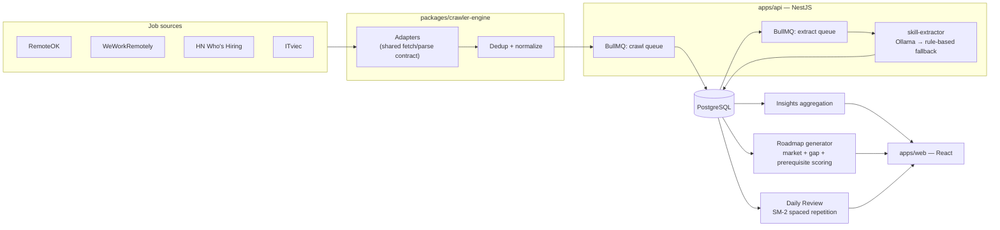

# Waypoint

[](https://github.com/anhkhoitran/waypoint/actions/workflows/ci.yml)

**A local-first job intelligence & interview prep dashboard** — it crawls job boards
with its own adapters, tells you what skills the market actually wants versus what
you have, and turns that gap into a week-by-week study plan with spaced repetition.

| Job Radar (light)                                          | Market Insights (dark)                                                         |
| ---------------------------------------------------------- | ------------------------------------------------------------------------------ |
|  |  |

## Why this exists

Job search dashboards usually mean paying for a SaaS or trusting a black-box scraper.
Waypoint runs its own crawling engine end to end — no third-party job APIs, no paid
scraping service — so every number on the Insights page traces back to a job posting
it fetched and parsed itself. The whole point is turning "the market wants X" into
"here's your plan to learn X," not just another job list. It's built to run entirely
on a laptop: Postgres and Redis in Docker, an optional local LLM for parsing, zero
recurring cost.

## Architecture



Everything in this diagram imports `packages/shared` — the Zod schemas both
`apps/api` and `apps/web` build against, so a field renamed on the API breaks the
build instead of failing silently at runtime.

### Design decisions (the interview version)

- **Adapter pattern for crawlers.** Each source (RemoteOK, WeWorkRemotely, HN Who's
  Hiring, ITviec) implements the same `fetchListings` / `parseDetail` contract against
  a `PageLike` abstraction, so unit tests run against saved HTML fixtures — no network,
  no flakiness — while the real adapter swaps in a fetch client or a Playwright page
  for the one source (ITviec) that needs JS rendering.
- **Failure is data, not a crash.** A crawl run's per-source status (success/partial/
  failed, jobs found, last run time) is written to the DB and surfaced directly in the
  UI's Source Health panel. If a site changes its markup, you see it as a stale
  "3 days ago · failed" badge — not a silent zero.
- **Local-first LLM with a graceful, invisible fallback.** Skill/seniority/salary
  extraction tries Ollama first for higher-quality parsing; on any timeout, connection
  refusal, or malformed response it falls back to a deterministic rule-based
  extractor. The app works identically with or without Ollama installed — there's no
  degraded mode the user has to know about.
- **Dedup by content, not by URL.** Jobs are deduplicated on a normalized
  `(title, company, source)` key rather than the source URL, because the same posting
  reappears at a new URL when boards refresh their listings.
- **SM-2 spaced repetition**, the same scheduling algorithm behind Anki, drives Daily
  Review — interval growth compounds off the _previous_ easiness factor, not the one
  just updated by the current grade, which is the detail most from-scratch
  implementations get wrong.
- **The roadmap is deterministic and idempotent.** Non-DSA topics are scored by
  market weight (demand share) + gap weight (demand share restricted to skills
  missing from your profile) + prerequisite order; the DSA ladder bypasses scoring
  and fills by canonical order. Regenerating only ever replaces `todo` items —
  anything `in_progress` or `done` is untouched, so hitting "regenerate" can't erase
  progress.

## Getting started

```bash
pnpm install
docker compose up -d && cp apps/api/.env.example apps/api/.env
pnpm --filter @waypoint/api run db:migrate && pnpm --filter @waypoint/api run db:seed
pnpm dev:api
pnpm dev:web   # in a second terminal — dashboard at http://localhost:5175
```

(`pnpm install`'s `postinstall` hook builds `packages/*` automatically — they ship
as compiled `dist/`, not raw source, so `apps/api`/`apps/web` can't resolve them
otherwise.)

Trigger a crawl once both are running: the "Run crawl" button in the Radar UI (or
`curl -X POST http://localhost:3001/crawl/run`). Then backfill skill extraction:
`pnpm --filter @waypoint/api run backfill` (or `curl -X POST http://localhost:3001/extract/backfill`).

### Optional: demo data

Don't want to wait on a real crawl? `pnpm demo:seed` loads a realistic snapshot —
~60 jobs across all 4 sources with extracted skills, a roadmap already a few weeks
in, 20 days of review history, and 8 applications spread across the pipeline — so
the dashboard looks lived-in immediately. It's idempotent (running it twice just
skips the second time) and safe to run alongside real crawled data.

### Optional: Playwright + local LLM

- **ITviec adapter** renders its listing pages with JS, so it needs a browser:
  `pnpm exec playwright install chromium`. The other three sources work over plain
  HTTP without it — skipping this only means ITviec shows up as unhealthy in Source
  Health until you install it.
- **Higher-quality skill extraction**: install [Ollama](https://ollama.com) and
  `ollama pull qwen2.5:3b`. Waypoint detects it automatically
  (`OLLAMA_URL`, default `http://localhost:11434`) and falls back to the rule-based
  extractor on any error — safe to run with or without it.

### Ports

| Service  | Port | Notes                                      |
| -------- | ---- | ------------------------------------------ |
| Web      | 5175 | 5173 is reserved for another local project |
| API      | 3001 |                                            |
| Postgres | 5433 | mapped from the container's 5432           |
| Redis    | 6380 | mapped from the container's 6379           |

## Screenshots

| Job Radar                                                                           | Market Insights                                                                      |
| ----------------------------------------------------------------------------------- | ------------------------------------------------------------------------------------ |
|  |  |

| Prep Roadmap                                                                                     | Daily Review                                                                   |
| ------------------------------------------------------------------------------------------------ | ------------------------------------------------------------------------------ |
|  |  |

| Application Tracker                                                                     | Profile                                                                                |
| --------------------------------------------------------------------------------------- | -------------------------------------------------------------------------------------- |
|  |  |

The whole UI ships in English and Vietnamese (toggle in the sidebar) and in light and
dark themes.

## Roadmap

Detailed step-by-step execution plans live in [docs/plans/](docs/plans/README.md).

- [x] **Phase 1** — Crawler engine + job feed (RemoteOK, WeWorkRemotely, HN Who's Hiring, ITviec)
- [x] **Phase 2** — Market insights + local LLM skill extraction (Ollama, rule-based fallback)
- [x] **Phase 3** — Prep roadmap + spaced-repetition question bank (DSA, system design, cloud, web)
- [x] **Phase 4** — Application tracker + CI + resume-ready polish

### Scoping notes

- Everything runs locally: Postgres/Redis in Docker, optional Ollama for JD parsing.
  No API keys, no paid services.
- LinkedIn is deliberately excluded (aggressive anti-bot measures and terms-of-service
  risk).
- Crawler adapters treat failure as data: source health is surfaced in the UI rather
  than silently ignored. When a source's markup drifts, the fix is: adapt the
  adapter, save a fresh HTML fixture, add a regression test — not "wait and hope."
- Match scores and salary medians are best-effort: match scoring only covers jobs
  with extracted skills, and the median salary stat only counts USD-parseable
  `salaryText` (VND and other formats are excluded rather than guessed at).
- i18n scope is UI chrome only (nav, buttons, labels, generated template strings).
  Curated content authored once and read many times — the 120 Daily Review cards,
  the 88 roadmap resource titles — and crawled job postings stay English-only; see
  [CLAUDE.md](CLAUDE.md) for the full convention.
- The Application Tracker's `Application.jobId` is nullable with a unique
  constraint, so manual (non-Radar) applications are unlimited while "track this
  job" stays idempotent — clicking it twice on the same job returns the existing
  application instead of erroring.
- Daily Review's streak/heatmap day boundaries are fixed to Asia/Ho_Chi_Minh
  regardless of server timezone, with a 10-new-card daily cap so a large unseen
  deck doesn't dump hundreds of cards into one session — in-progress cards are
  never throttled.

## License

[MIT](LICENSE)
