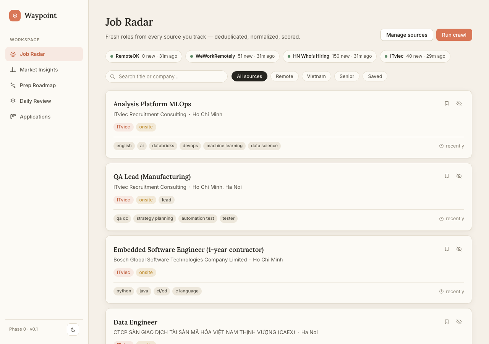
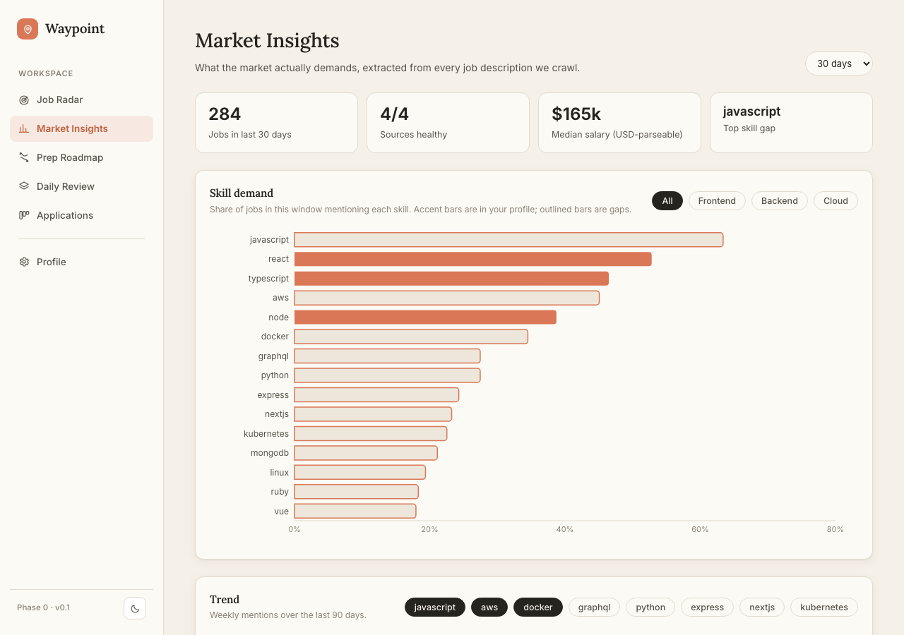

# Waypoint

**Local-first job intelligence & interview prep dashboard.**

Waypoint runs its own crawling engine against job boards you care about, analyzes what
skills the market actually demands, and turns the gap between market demand and your
profile into a personalized interview-prep roadmap — with zero paid services.

## Architecture

```
waypoint/
├── apps/
│   ├── web/               # React + Vite — the dashboard UI
│   └── api/               # NestJS + Prisma + PostgreSQL, BullMQ workers
├── packages/
│   ├── crawler-engine/    # Framework-agnostic crawling engine (adapters, pipeline, dedup)
│   ├── shared/            # Zod schemas & types shared across all packages
│   └── ui/                # Design tokens + component library
```

## Screenshots

| Job Radar | Market Insights |
| --- | --- |
|  |  |

## Getting started

```bash
pnpm install
pnpm exec playwright install chromium   # needed for the ITviec adapter
docker compose up -d                    # Postgres :5433, Redis :6380
cp apps/api/.env.example apps/api/.env
cd apps/api && pnpm db:migrate && pnpm db:seed && cd ../..
pnpm dev:web                            # dashboard at http://localhost:5175
pnpm dev:api                            # API at http://localhost:3001
```

Trigger a crawl once both are running: `curl -X POST http://localhost:3001/crawl/run`
(or use the "Run crawl" button in the Radar UI). Then backfill skill extraction:
`curl -X POST http://localhost:3001/extract/backfill` (or `pnpm --filter @waypoint/api backfill`).

### Optional: local LLM skill extraction

Skill/seniority/salary extraction works out of the box with a deterministic
rule-based extractor — no setup required. For higher-quality extraction, install
[Ollama](https://ollama.com) and pull a small model:

```bash
ollama pull qwen2.5:3b
```

Waypoint detects Ollama automatically (`OLLAMA_URL`, default
`http://localhost:11434`) and falls back to the rule-based extractor on any
timeout, connection error, or malformed response — so it's always safe to run
with or without Ollama installed.

### Ports

| Service    | Port | Notes                                    |
| ---------- | ---- | ----------------------------------------- |
| Web        | 5175 | 5173 is reserved for another local project |
| API        | 3001 |                                            |
| Postgres   | 5433 | mapped from container's 5432              |
| Redis      | 6380 | mapped from container's 6379               |

## Roadmap

Detailed step-by-step execution plans live in [docs/plans/](docs/plans/README.md).

- [x] **Phase 0** — Monorepo foundation, design system, app shell
- [x] **Phase 1** — Crawler engine + job feed (RemoteOK, WeWorkRemotely, HN Who's Hiring, ITviec)
- [x] **Phase 2** — Market insights + local LLM skill extraction (Ollama, rule-based fallback)
- [ ] **Phase 3** — Prep roadmap + spaced-repetition question bank (DSA, system design, cloud, web)
- [ ] **Phase 4** — Application tracker + polish

### Scoping notes

- Everything runs locally: Postgres/Redis in Docker, optional Ollama for JD parsing. No API keys, no paid services.
- LinkedIn is deliberately excluded (aggressive anti-bot measures and terms-of-service risk).
- Crawler adapters treat failure as data: source health is surfaced in the UI rather than silently ignored.
- Match scores and salary medians are best-effort: match scoring only covers jobs
  with extracted skills, and the median salary stat only counts USD-parseable
  `salaryText` (VND and other formats are excluded rather than guessed at).
